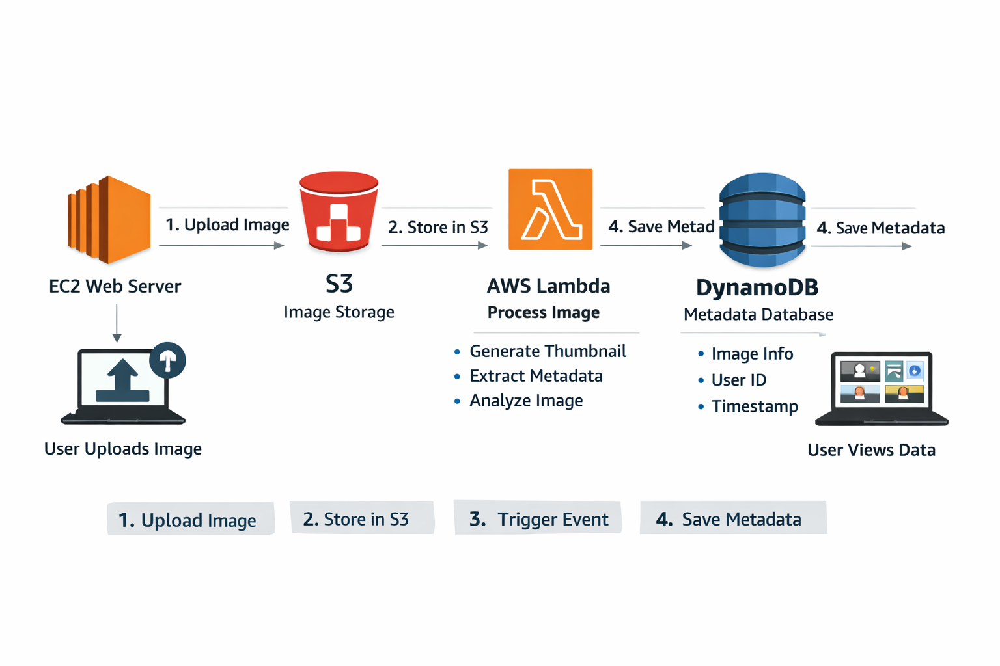

# Image Upload & Processing System

Cloud-native, event-driven pipeline for secure image uploads, automated processing, and metadata storage using AWS.

## 1) Problem Statement

Modern applications need to handle user-generated images reliably and at scale. Key requirements:

- Securely upload files.
- Store files durably and cost-effectively.
- Automatically process uploads (for example: metadata extraction, thumbnails).
- Keep structured records for fast retrieval and display.

Traditional monolithic systems can struggle with scaling, automation, and operational costs. This solution uses managed AWS services to address those gaps.

## 2) Solution Approach

The system combines four AWS services:

- **Amazon EC2**: Hosts a FastAPI application for user uploads.
- **Amazon S3**: Stores uploaded images.
- **AWS Lambda**: Automatically runs processing logic on new uploads.
- **Amazon DynamoDB**: Stores extracted metadata for fast lookup.

### Why this works

- **Scalable**: S3 and DynamoDB scale automatically.
- **Automated**: Lambda is triggered by S3 events.
- **Flexible**: EC2 can run any web framework stack.
- **Cost-efficient**: Pay-as-you-go managed services.

## 3) Architecture Overview

### Workflow

1. User uploads an image through the FastAPI app on EC2.
2. The image is stored in S3.
3. S3 event notification triggers a Lambda function.
4. Lambda extracts metadata (size, timestamp, etc.).
5. Lambda writes metadata to DynamoDB.
6. EC2/FastAPI reads DynamoDB and displays results.

## 4) Architecture Diagram

> Add your architecture image path below (example: `assets/architecture.png`).

## 5) Demo Video

> Add your demo video path below (example: `assets/demo.mp4`).

<video controls width="800">
  <source src="video-ex.webm" type="video/mp4" />
  Your browser does not support the video tag.
</video>

## 6) Implementation Steps

### Step 1: EC2 Setup

- Launch an EC2 instance (Amazon Linux or Ubuntu).
- Install Python, FastAPI, Uvicorn, and Boto3.
- Deploy FastAPI endpoints for image upload.

### Step 2: S3 Bucket

- Create an S3 bucket (example: `image-upload-demo-bucket`).
- Configure bucket permissions and event notifications.

### Step 3: IAM Role

Create and attach IAM roles/policies for EC2 and Lambda:

- `AmazonS3FullAccess`
- `AmazonDynamoDBFullAccess`
- `AWSLambdaBasicExecutionRole`

### Step 4: DynamoDB Table

- Create table: `ImageMetadata`
- Partition key: `ImageID` (String)

### Step 5: Lambda Function

- Triggered by S3 object-created events.
- Extracts metadata (for example: object size and upload timestamp).
- Stores metadata in DynamoDB.

### Step 6: Security Group

- Allow inbound traffic on port `8000` for FastAPI.
- Restrict access to trusted IP ranges where possible.

## 7) Main Code Components

- **FastAPI (EC2)**: Handles upload requests and application-facing metadata operations.
- **Lambda (Serverless)**: Processes S3 events and writes metadata records to DynamoDB.

## 8) Testing Checklist

- Upload an image via `/upload/`.
- Verify the object appears in the S3 bucket.
- Verify metadata record appears in DynamoDB.
- Open API docs at `http://<EC2-Public-IP>:8000/docs`.

## 9) Benefits

- **Scalable**: S3 and DynamoDB handle growth automatically.
- **Automated**: Lambda removes manual processing steps.
- **Cost-efficient**: Usage-based pricing.
- **Modular**: Each service has a clear responsibility.

## 10) Future Enhancements

- Integrate AWS Rekognition for image analysis.
- Add CloudFront for global CDN delivery.
- Add Cognito for authentication and user management.
- Deploy FastAPI behind Nginx for production hardening.